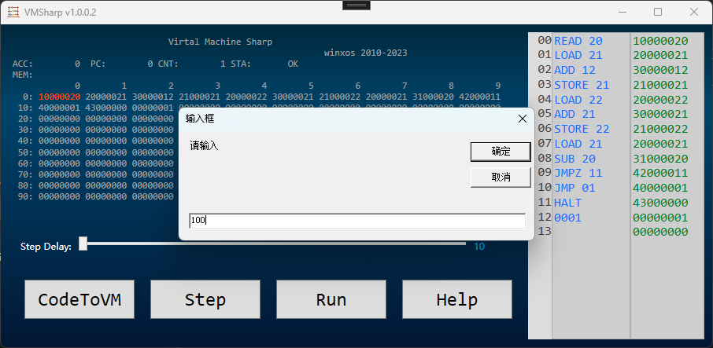

# Virtual Machine CSharp 

simpletron implement in book "c how to program".

The default code is to calculate the sum of 1..n ,

if you input 100, then you will get 5050 in the mem[22]

just for teaching the basic programming conception.

winxos 20230725

